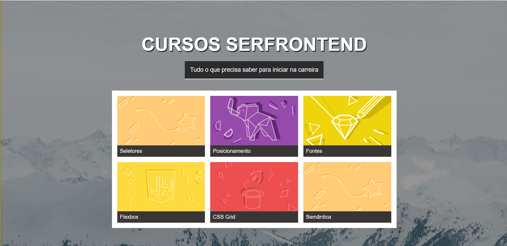

# Página com Cards 🃏

Bem-vindo ao repositório da **Página com Cards** – um projeto desenvolvido durante um curso, com o objetivo de criar uma página web que exibe cards informativos de maneira estilizada e responsiva.

---

## 📸 Captura de Tela



---

## 🛠️ Tecnologias Utilizadas

- **HTML5:** Estruturação semântica da página.
- **CSS3:** Estilização e responsividade dos elementos.
- **Git:** Controle de versão para acompanhamento do desenvolvimento.

---

## 📂 Estrutura do Projeto

- `index.html` – Estrutura principal da página.
- `estilo/` – Pasta contendo os arquivos CSS para estilização.
- `imagens/` – Pasta com as imagens utilizadas nos cards.
- `Screenshot.png` – Captura de tela da página para visualização rápida.

---

## 🚀 Como Executar o Projeto Localmente

1. **Clone o Repositório:**
   ```bash
   git clone https://github.com/rian-lf13/PaginaComCards.git
